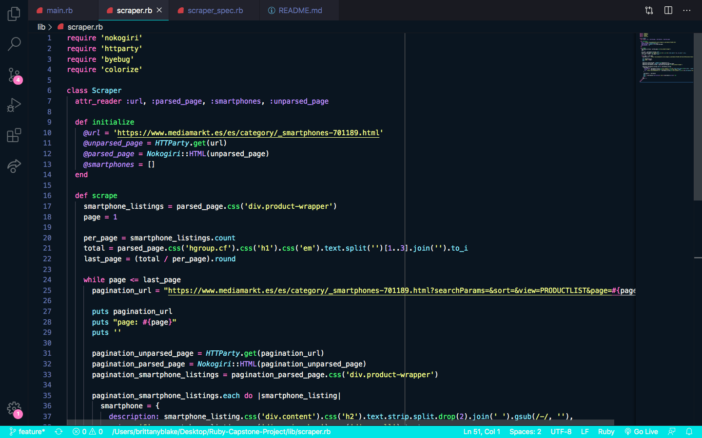
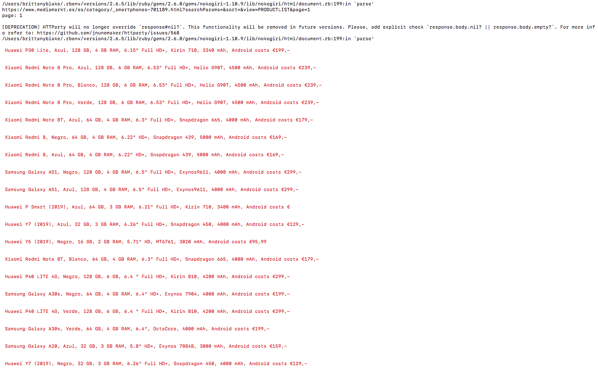

# Ruby-Capstone-Project

<!--
*** Thanks for checking out this README Template. If you have a suggestion that would
*** make this better, please fork the repo and create a pull request or simply open
*** an issue with the tag "enhancement".
*** Thanks again! Now go create something AMAZING! :D
-->

<!-- PROJECT SHIELDS -->
<!--
*** I'm using markdown "reference style" links for readability.
*** Reference links are enclosed in brackets [ ] instead of parentheses ( ).
*** See the bottom of this document for the declaration of the reference variables
*** for contributors-url, forks-url, etc. This is an optional, concise syntax you may use.
*** https://www.markdownguide.org/basic-syntax/#reference-style-links
-->
[![Contributors][contributors-shield]][contributors-url]
[![Forks][forks-shield]][forks-url]
[![Stargazers][stars-shield]][stars-url]
[![Issues][issues-shield]][issues-url]

<!-- PROJECT LOGO -->
 

  

  <h3 align="center">Web Scraper</h3>

  

    This is the Capstone Project for the Ruby section of the Microverse curriculum.
     
    <a href="https://github.com/BrittanyBlake/Ruby-Capstone-Project"><strong>Explore the docs »</strong></a>
     
     
    <a href="https://github.com/BrittanyBlake/Ruby-Capstone-Project/issues">Report Bug</a>
    ·
    <a href="https://github.com/BrittanyBlake/Ruby-Capstone-Project/issues">Request Feature</a>
  

<!-- TABLE OF CONTENTS -->
## Table of Contents

* [About the Project](#about-the-project)
  * [Built With](#built-with)
* [Contact](#Authors)
* [Acknowledgements](#acknowledgements)
* [How it works](#How-it-works)

<!-- ABOUT THE PROJECT -->
## About The Project

Capstone projects are solo projects at the end of the each of the Microverse Main Technical Curriculum sections. It is a real-world-like project built with business specifications This project was at the end of the Ruby curriculum section. I was asked to create a web scraper with Ruby. I chose to scrape information from a popular store here in Spain, <a href="https://www.mediamarkt.es/es/category/_smartphones-701189.html?searchParams=&sort=&view=PRODUCTLIST&page=1">Mediamarkt</a> where I often shop. My project collects information about the description and specifications of the smartphones they have available. 

## LIVE VIDEO 

https://github.com/BrittanyBlake/Ruby-Capstone-Project 

<!-- BUILD WITH -->
## Built With
This project was built using these technologies.
* Ruby
* Rubocop
* VSCode
* Rspec

<!-- ABOUT THE PROJECT -->
## Installation

### Setup

In order to test my Web Scraper, you will need to ensure you have the latest version of ruby and RSPEC installed.

### Install

To test Stack bot locally, clone the repository, navigate to it's containing directory, and run:

#### Clone the repository and follow the steps to run the bot.

- $ `git clone git@github.com:BrittanyBlake/Ruby-Capstone-Project.git`
- $  bundle install    -> run this command to install the required gems
- $  bin/main.rb       -> run this command to run the program
- $  gem install rspec -> run this command to install rspec 
- $  rspec             ->run this command to test the program with rspec

<!-- HOW IT WORKS -->

<!-- CONTACT -->
## Authors

👤 **Brittany Blake**

- Github: [@BrittanyBlake](https://github.com/BrittanyBlake)
- Twitter: [@bbcodes_](https://twitter.com/bbcodes_)
- Linkedin: [Brittany Blake](https://www.linkedin.com/in/brittany-blake-843951109/)

<!-- ACKNOWLEDGEMENTS -->
## Acknowledgements
* [Microverse](https://www.microverse.org/)
* [Ruby Documentation](https://www.ruby-lang.org/en/documentation/)
* [YouTube Tutorial by Zayne](https://www.youtube.com/watch?v=b3CLEUBdWwQ)
* used gem `httparty`

## Show your support

Give a ⭐️ if you like this project!

<!-- MARKDOWN LINKS & IMAGES -->
<!-- https://www.markdownguide.org/basic-syntax/#reference-style-links -->
[contributors-shield]: https://img.shields.io/github/contributors/BrittanyBlake/Ruby-Capstone-Project.svg?style=flat-square
[contributors-url]: https://github.com/BrittanyBlake/Ruby-Capstone-Project/graphs/contributors
[forks-shield]: https://img.shields.io/github/forks/BrittanyBlake/Ruby-Capstone-Project.svg?style=flat-square
[forks-url]: https://github.com/BrittanyBlake/Ruby-Capstone-Project/network/members
[stars-shield]: https://img.shields.io/github/stars/BrittanyBlake/Ruby-Capstone-Project.svg?style=flat-square
[stars-url]: https://github.com/BrittanyBlake/Ruby-Capstone-Project/stargazers
[issues-shield]: https://img.shields.io/github/issues/BrittanyBlake/Ruby-Capstone-Project.svg?style=flat-square
[issues-url]: https://github.com/BrittanyBlake/Ruby-Capstone-Project/issues

## 📝 License

This project is [MIT](https://opensource.org/licenses/MIT) licensed.
